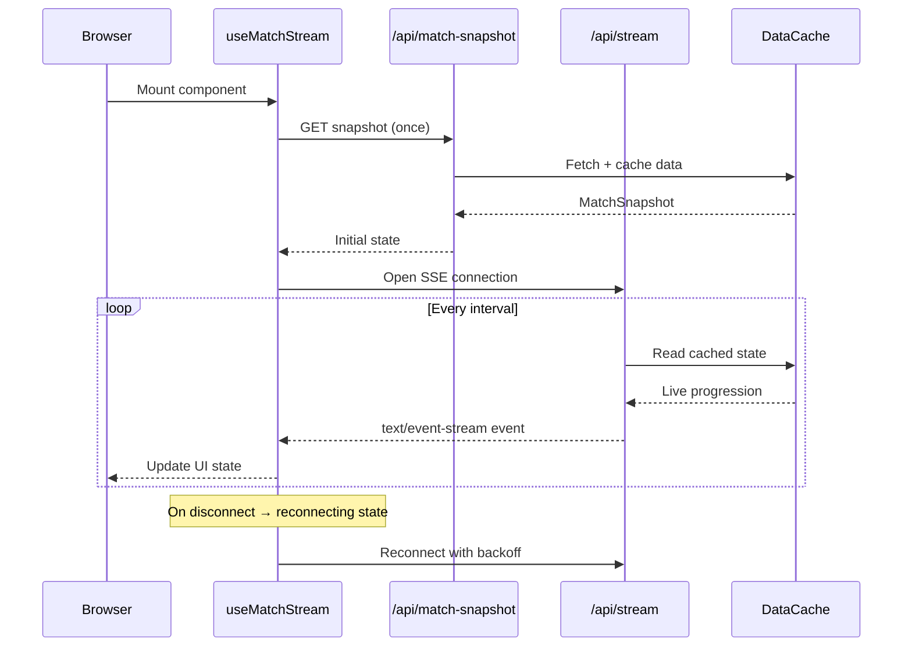
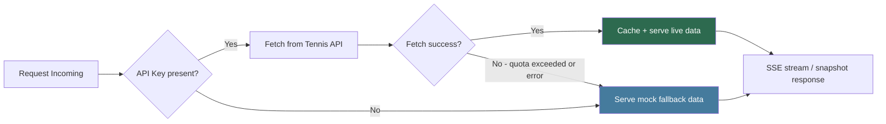
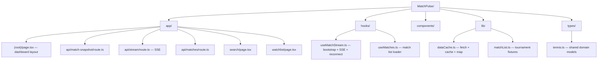

# MatchPulse: Real-Time Tennis Match Dashboard

Production-style tennis operations dashboard built with Next.js App Router, Server-Sent Events, and a hybrid live-data strategy designed for low API quotas.

This project is intentionally shaped to reflect real-world sports dashboard constraints:

* live UX expectations
* noisy / incomplete feed data
* strict external API request limits
* clear separation between snapshot data and stream updates

---

## Why This Project Exists

This app is built as a portfolio project where reliability, clarity, and product thinking matter as much as UI polish.

The goal is not just chart rendering. The goal is to demonstrate:

* realtime state handling
* resilient fallback behavior
* scalable architecture decisions under data constraints
* a user-facing interface that feels like a real sports product

---

## Core Features

* Live dashboard with SSE updates (`/api/stream`)
* One-time snapshot bootstrap (`/api/match-snapshot`)
* Extended live rail with mock fallback (`/api/matches`)
* Search and Watchlist pages driven by route-level navigation
* Match cards, event timeline, and chart sections for match intelligence
* Reconnect-aware stream hook (`connecting`, `live`, `reconnecting`)
* Local watchlist persistence via `localStorage`

---

## Product Pages

* `/` Dashboard: live match center, live rail, analytics, events
* `/search` Match discovery and filtering
* `/watchlist` Saved matches feed

---

## Live Data Strategy (Quota-Friendly)

Free live tennis APIs are heavily rate-limited (for example, 100 requests/day at entry level). Polling every 10 seconds would exceed quota quickly.

This app uses a practical hybrid approach:

1. Fetch one snapshot and cache it on the server.
2. Serve that snapshot to initialize UI state.
3. Simulate live progression over SSE without repeatedly hitting the external API.
4. Backfill missing live cards with mock data so the interface remains rich and demo-ready.

This approach keeps the product realistic while respecting strict API budgets.

---

## Architecture Overview

### System Architecture

```mermaid
graph TD
    subgraph Client["Client (Browser)"]
        UI[Next.js App Router UI]
        HMS[useMatchStream Hook]
        HML[useMatches Hook]
        WL[Watchlist - localStorage]
    end

    subgraph Server["Server (Next.js Route Handlers)"]
        SS[/api/match-snapshot]
        ST[/api/stream - SSE]
        ML[/api/matches]
    end

    subgraph DataLayer["Data Layer"]
        DC[dataCache.ts]
        MLT[matchList.ts]
        TY[types/tennis.ts]
    end

    subgraph External["External"]
        API[Tennis API - api-sports.io]
        MOCK[Mock Fallback Data]
    end

    UI --> HMS
    UI --> HML
    UI --> WL

    HMS -->|bootstrap snapshot| SS
    HMS -->|subscribe| ST
    HML -->|fetch cards| ML

    SS --> DC
    ST --> DC
    ML --> MLT

    DC -->|live fetch| API
    DC -->|on failure / quota exceeded| MOCK
    DC --> TY
    MLT --> TY
```

### SSE Stream Flow



### Data Fallback Strategy



### Project Structure



---

## Running Locally

```bash
pnpm install
pnpm dev
```

Open http://localhost:3000

Optional environment variable:

```bash
TENNIS_API_KEY=your_api_sports_key
```

If no key is provided (or live fetch fails), the app falls back to local mock snapshot data.

---

## API Endpoints

| Endpoint | Description |
|---|---|
| `GET /api/match-snapshot` | Returns one cached `MatchSnapshot` object |
| `GET /api/stream` | Returns `text/event-stream` updates for dashboard live state |
| `GET /api/matches` | Returns match cards for live/upcoming/completed sections with dedup and mock backfill |

---

## Senior-Level Engineering Decisions Demonstrated

* Clear boundary between snapshot retrieval and stream transport
* Quota-aware API integration with graceful fallback
* Typed domain model shared between API routes and UI
* Connection-state-aware UX for real-time feed handling (`connecting`, `live`, `reconnecting`)
* Dedicated hooks for stream and list data access

---

## Tech Stack

* **Framework:** Next.js (App Router)
* **Language:** TypeScript
* **Styling:** Tailwind CSS
* **Charts:** Recharts
* **Icons:** Lucide Icons
* **Transport:** Server-Sent Events (SSE)

---

## Next Improvements

* Add event IDs and resume support (`Last-Event-ID`) for stream recovery
* Add sequence/version handling to guard against stale updates
* Add tests for merge logic and route-level live card generation
* Add observability hooks for connection count and stream errors

---

## Recruiter Quick Notes

This repository is built to showcase how I approach real-time sports products:

* balancing UX with operational constraints
* building for reliability under imperfect data
* structuring code for maintainability and scale

If you are evaluating for a live dashboard, start with:

* `app/(root)/page.tsx`
* `hooks/useMatchStream.ts`
* `app/api/stream/route.ts`
* `app/api/matches/route.ts`

---

## Author

**Saugat Giri** — [portfolio-saugat.vercel.app](https://portfolio-saugat.vercel.app) | [GitHub](https://github.com/saugat-15)
